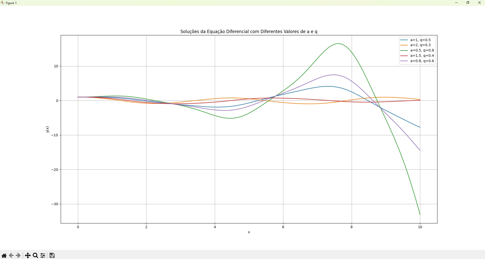

# Simulação de Movimento de Pêndulo

## Equação 

A equação do movimento de um pêndulo é descrito pela seguinte equação diferencial:

### d^2θ/dt^2 + (g/l)*sen(θ) = 0

onde: 
- g é aceleração da gravidade
- l é o comprimento do pêndulo.

## Método

Este código simula o movimento de um pêndulo sob a influência de forças variáveis. O modelo utiliza o método de Runge-Kutta de ordem 5 (RK45) para resolver a equação diferencial e variando os valores de a e q:

### y''(x) = -(a - 2q * cos(2x)) * y(x)

onde:
- y(x) representa a posição do pêndulo,
- a e q são parâmetros que influenciam o comportamento do movimento.

## Condições Iniciais

As condições iniciais para a simulação são:
- y(0) = 1 (posição inicial do pêndulo)
- y'(0) = 0 (velocidade inicial do pêndulo)

## Parâmetros

Os parâmetros a e q podem ser ajustados para explorar diferentes comportamentos do pêndulo. Exemplos de valores usados na simulação incluem:
- (a=1, q=0.5)
- (a=2, q=0.3)
- (a=0.5, q=0.8)
- (a=1.5, q=0.4)
- (a=0.8, q=0.6)

## Tecnologias Utilizadas

- Python
- NumPy
- Matplotlib
- SciPy

## Instalação

Para rodar o código, você precisará ter o Python instalado em seu computador. Você pode instalar as bibliotecas necessárias usando `pip`:

```bash
pip install numpy matplotlib scipy
```

# Gráfico



